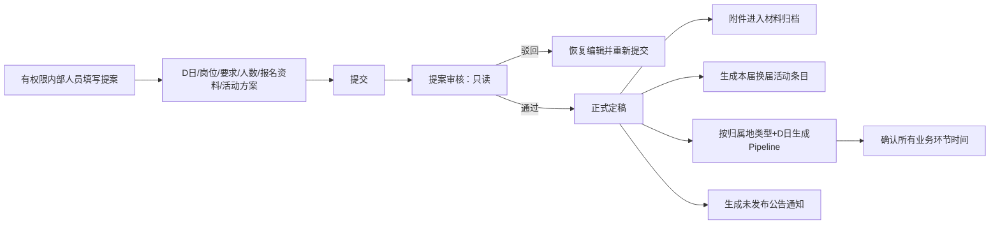

# 项目案件总卷

## 案件定位

这是一个业务规则、多个代码版本、历史操作和文档口供互相污染的濒危项目。当前任务不是立即修代码，而是先完成现场封存、证据分级、案情重建，再决定唯一修复路线。

## 角色

- 探长：负责证据分级、矛盾裁决、技术判断和修复决策。
- 助理：提供甲方资料、指出异常、补充业务背景和确认现场事实。
- “庸医口供”：历史代理生成的 Markdown、审计报告、日志和结论，只能作为线索，不能直接作为事实。

## 定盘星

唯一权威业务来源：

`C:\Users\zo4xi\Desktop\3\甲方真相，矛盾以此份为准，村居换届倒排工期表【新增业务操作阶段映射列   公告正文模板】 (1).docx`

Linux 映射：`/mnt/c/Users/zo4xi/Desktop/3/甲方真相，矛盾以此份为准，村居换届倒排工期表【新增业务操作阶段映射列   公告正文模板】 (1).docx`

裁决顺序：甲方 DOCX > 可重复验证的真实代码/数据库行为 > Git 历史和运行日志 > 历史 Markdown 口供 > 代理主观结论。

## 现场保护令

1. 原项目 `3` 只读取证，未完成案情底稿前不改业务代码。
2. `3_clean` 不作为可信成果，不覆盖、不继续叠加修改。
3. 所有新材料写入本目录，原始证据只记录路径、哈希、时间和来源，不覆盖原件。
4. 每个结论必须带证据编号和状态：已证实、强线索、待核验、被否定。
5. 任何“版本更新”“功能完整”“测试通过”都必须重新验证，不能继承历史口供。

## 24 小时破案路线

### 第一阶段：收口封存

登记目录、原始 DOCX、所有 Markdown、JSON 对话、Git 状态、启动配置、数据库连接线索和历史代理改动。

### 第二阶段：口供交集

把所有 Markdown 按主题切片：项目本质、角色权限、D 日计算、阶段流程、公告、候选人、材料、归档、版本选择。只保留不同口供共同陈述的部分，标记为“基础认知候选”，不直接定案。

### 第三阶段：白板重建

画四张图：

1. 案情总图：参与者、模块、数据流、外部依赖。
2. 病情图：重复目录、版本分叉、接口断裂、权限漏洞、日期计算风险。
3. 分歧图：根 `web` 与 `backend/web` 的逐文件差异及证据来源。
4. 变更关系图：历史代理做过什么、影响什么、哪些已撤销、哪些仍存疑。

### 第四阶段：甲方裁决

将 DOCX 的业务阶段、操作映射、公告正文模板和约束逐条编号，与代码实现逐条对照。冲突登记，不靠“看起来合理”自动合并。

### 第五阶段：最小验证

只验证能改变判断的关键点：日期偏移、阶段生成、权限边界、登录分流、公告正文、版本依赖和核心 API 联动。先形成证据闭环，再制定修复。

## 当前案情判断

### A-005 多源会诊污染

- 多个历史代理对同一项目分别取证、定义和改动，存在错误字段被后续代理当成既定事实继续调用的风险。
- 污染可能跨越数据库、后端接口、前端页面、小程序和权限判断，不能只查单一模块。
- 当前最高调查目标是还原字段和概念的传播链，找出污染源及其最后影响点。
- 任何字段名、接口名或历史数据都不能替代甲方对业务对象的定义。

## 甲方证言补录 A-001

本节为甲方直接说明，优先级等同甲方 DOCX，作为当前业务定盘事实。原始表述由调查员整理为可核验条目，未自行扩展业务含义。

### 业务对象与规模

- 系统管理两类组织：村子与社区。
- 对应两类换届选举组织：村委会与社区居委会。
- 总量约 130 多个村、社区。
- 村与社区总体流程大致相同，但选举细节和岗位存在方式差异。

### D 日与流程复用

- 每个村、社区都有自己的选举日期。
- `D` 定义为某一归属地自己的选举日期。
- 业务流是完整的 SOP Pipeline：先把一个村或社区跑通，其他归属地复用同一套流程。
- 复用的是流程规则，变化的是归属地、日期、岗位、选举细节和业务数据。
- 社区同样遵循这套“单一流程、多归属地数据”的原则。

### 系统边界

- 项目是政务内部系统，不面向社会公众开放注册。
- 后端管理端是重点，面向基层选举内部工作人员。
- 系统同时承担基层选举内部管理、信息公示、参选人材料收集和送审。

### 小程序端

- 使用者主要是参加选举的参选人，以及关注自身是否选上、竞选进展的相关人员。
- 普通公众即使理论上可以注册，也不是实际业务目标用户，不能据此扩展成公众社区或公开政务平台。
- 小程序功能保持简单：
  - 按用户归属地展示该村或社区自己的日程 Pipeline 和进展。
  - 供想报名竞选的人上传报名材料。
  - 展示与参选人自身相关的竞选进展。
- 小程序不是完整管理后台，不承担内部人员的流程配置和管理职责。

### 后端管理端与账号识别

- 管理端不直接面向参选人，面向内部工作人员。
- 登录识别三要素缺一不可：归属地 + 账号 + 密码。
- 后台不开放外人自行注册。
- 账号由平台超管秘密创建和分配。

### 平台超管的隐藏账号能力

- 平台超管是平台方，拥有全部权限。
- 平台超管拥有专属的后台账号创建能力，该能力不是普通公开注册入口。
- 创建流程：
  1. 下拉选择村子或社区。
  2. 再下拉选择该归属地的子管理、经办编辑或审核人角色。
  3. 输入绑定人的手机号和密码。
  4. 初始密码为 `123456`。
  5. 点击添加后，对应村子或社区的后台账号才可登录。
- 角色至少包括：子管理、经办编辑、审核人；具体权限边界仍需结合甲方 DOCX 和代码逐项核验。

### 甲方事实带来的调查约束

- 任何不区分村/社区的统一日期、岗位或流程实现，都属于高风险待核验点。
- 任何把小程序做成公众开放平台的设计，属于越界风险。
- 任何绕过“归属地 + 账号 + 密码”任一要素的登录路径，属于高风险待核验点。
- 任何允许外部自行创建后台账号的接口或页面，属于高风险待核验点。
- `123456` 是甲方明确给出的初始密码事实，但是否必须首次登录修改、如何存储和重置，不能自行臆测，需继续取证。

## 甲方技术偏好补录 A-003

- 甲方不介意后端和前端使用成熟模板框架快速建设。
- 甲方反而认为使用成熟框架更不容易出错，这是明确的技术偏好，不是待核验的业务规则。
- 因此，后续重组或修复可以优先考虑成熟模板、标准组件和既有工程约定，重点是保持甲方业务事实、权限边界和 D 日 Pipeline 不变。
- 快速并不等于拼接旧代码。模板可以速成页面和工程骨架，但业务字段、状态、权限、日期窗口和公告正文必须以甲方事实重新验收。

### 有效修复装备：TDesign MCP

甲方提供的腾讯官方 TDesign MCP 配置：

```json
{
  "mcpServers": {
    "tdesign-mcp-server": {
      "command": "npx",
      "args": ["-y", "tdesign-mcp-server@latest"]
    }
  }
}
```

- `tdesign-mcp-server` 登记为有效的快速重组和修复工具。
- 适用方向：基于腾讯官方 TDesign 组件和模板快速构建一致的管理端界面，减少手写 UI 和常见交互错误。
- 工具能力不能替代业务取证；不得因为 MCP 能生成页面就自行决定字段、角色、状态或流程。
- 使用前仍需确认当前 Jcode MCP 配置、真实连接状态和工具 schema，不能把示例 JSON 当成已连接事实。

## 甲方证言补录 A-006：提案驱动的换届业务主链

### 提案是后端业务起点

- 提案由有权限的内部角色发起，当前已知包括：子管理、平台超管、经办编辑。
- 提案至少包含：
  - `D day`，即该归属地本届选举日期。
  - 本届换届的岗位。
  - 每个岗位的要求。
  - 每个岗位的人数。
  - 参选人报名所需资料。
  - 本届活动方案等文档附件和文本编辑内容。
- 提交提案后，提案进入审核状态，审核期间可查看但不可修改。
- 提案审核驳回后，才恢复编辑能力，允许修订后重新提交。
- 提案审核通过后，正式定稿，不再按普通编辑态处理。

### 审核通过后的自动生成链

提案审核通过是一次业务定稿和初始化触发点。系统应基于已定稿提案、归属地类型和该归属地的 D 日，自动完成：

1. 提案文件附件转入侧边栏“材料归档”。
2. 生成一条正式的本届换届活动条目。
3. 保留每一届活动的历史列表记录。
4. 按 `D day` 和归属地类型生成当届完整日期日程 Pipeline。
5. 自动生成当届“公告通知”记录，初始为未发布状态。
6. 由 Pipeline 确认后续各环节的时间，不允许各模块各自手工发明日期。

### 主链关系



### 主链不可破坏的约束

- 提案未通过，不能生成正式当届 Pipeline、活动定稿条目和对应公告全量计划。
- 审核中的提案必须只读，不能一边审核一边改内容。
- 驳回和通过是不同状态，驳回必须能回到可编辑态，通过必须形成定稿边界。
- 日程生成输入至少包含归属地类型和 D 日，不能只用一个全局日期模板。
- 附件归档、届次活动、日程 Pipeline 和公告通知属于同一次定稿后的联动初始化，需防止只生成一部分。
- “未发布公告”不是随意新增的孤立公告，而是 Pipeline 初始化后的待发布业务记录。
- 具体公告数量、正文模板、阶段映射和岗位差异仍须以甲方 DOCX 逐条补齐。

## 甲方证言补录 A-007：日程驱动公告与报名材料链

### 公告通知链

- Pipeline 确定每个环节的日期后，系统在需要发公告前提前通知经办编辑和子管理。
- 内部人员登录后台，在小编工作台查看待处理公告。
- 公告内容从公告模板预置，原则上直接套用；小编只做必要的小修改和确认。
- 确认后设置定时发布，公告到时间自动发布。
- 已发布公告在小程序端可见。
- 公告不是自由创作的孤立内容，而是由 Pipeline 时间和公告模板共同驱动的待办。

### 参选人报名与材料链

- 到达允许报名、自荐候选人的日期后，参选人按照提案中岗位材料要求，在小程序端提交报名材料。
- 后台“材料提交管理”集中展示提交人的材料和附件明细。
- 后台小编和子管理都可以查看提交内容并参与审核，具体动作权限仍需核验。
- 材料审核通过后，提交人转入“候选人管理”池子，进入后续审核流程。
- 材料提交有两种来源：
  1. 小程序端参选人自荐提交。
  2. 后台工作人员手工录入的“组织推荐”。
- 组织推荐当前被甲方判断为历史实现暂时没有明显错误，但仍需与代码和 DOCX 交叉验真。
- 任何上传文件都必须进入对应的材料归档文件夹，不能丢失、悬空或只保存在临时目录。

### 该链的闭环

`Pipeline 日期到达 → 公告待办提醒 → 模板预置 → 小编小修改确认 → 定时发布 → 小程序展示`

`报名窗口到达 → 参选人小程序自荐 / 后台组织推荐 → 材料提交管理 → 小编/子管理审核 → 通过后进入候选人池 → 附件进入对应材料归档`

## 甲方证言补录 A-008：候选人按届管理与多附件

- 候选人管理先按每一届列出，再进入该届候选人明细。
- 候选人审核是小编线下送审、线下处理，后台只负责审核结果回填和进展记录。
- 候选人进展会同步到小程序候选人展示处；参选人可在个人中心查看自己的各轮结果。
- 候选人的报名材料一定是多份附件。
- 当前后台只能预览一份附件，这是已确认的严重功能缺陷，不能当成业务要求。
- 后续必须以附件集合处理，全部附件可查看、预览、下载、归档和追溯，不能只取第一份或覆盖旧附件。

- 已知：历史代理曾在 `3_clean` 上做过版本拼接，并承认没有完成完整验证。
- 已知：两份前端不是简单的新旧关系，至少存在文件级交叉修改。
- 已知：此前 TypeScript、页面渲染和完整端到端验证没有形成可靠闭环。
- 已知：历史 Markdown 全部降级为口供，不能压过甲方 DOCX。
- 未知：甲方 DOCX 的完整业务规则与代码当前实现的逐项差异。
- 未知：原项目当前工作区、Git 历史和 `3_clean` 现状是否仍含历史代理残留。

## 下一步

先完成 `01_证据登记表.md`、`02_口供交集表.md`、`03_白板案情图.md`，再读取甲方 DOCX，最后才做代码取证。
