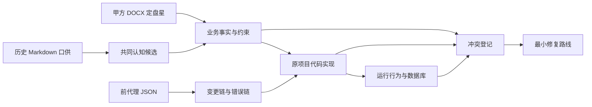
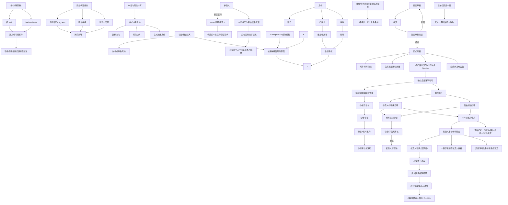

# 白板：案情、病情与脉络

## 案情总图

## 病情关系图

## 分歧脉络表

| 脉络 | 要回答的问题 | 当前证据 | 结论 |
|---|---|---|---|
| 版本脉络 | 两个 web 谁在什么文件上改了什么？ | E-004/E-005 | 待核验 |
| 时间脉络 | D 日如何计算和生成阶段？ | E-001/E-004 | 待核验 |
| 权限脉络 | 超管、组织账号、业务角色如何登录和授权？ | E-001/E-004 | 待核验 |
| 数据脉络 | 组织、选举、阶段、候选人、材料如何关联？ | E-001/E-004 | 待核验 |
| 公告脉络 | 模板正文、编辑入口、发布条件是什么？ | E-001 | 待提取 |
| 事故脉络 | 历史代理改了什么、留下什么未验证状态？ | E-002/E-006 | 部分已知 |

## 白板纪律

白板只放“问题、证据、关系、状态”，不放未经证实的修复方案。每条箭头必须能回指证据编号。
