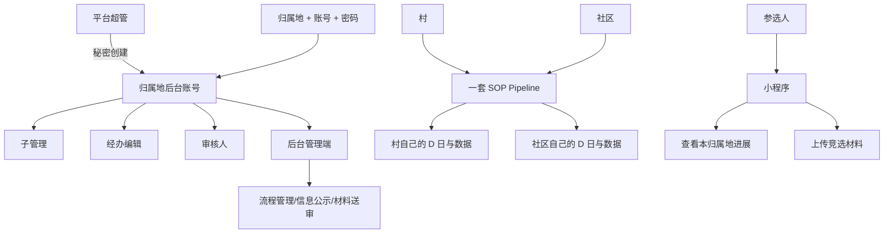

# 甲方证言 A-001：组织、边界、账号与角色

## 证据属性

- 来源：甲方在本次调查中的直接说明
- 证据等级：A，业务权威
- 处理状态：已登记，待与甲方 DOCX 逐条交叉核验
- 记录原则：以下为结构化转录，不替甲方补充未说出的规则

## 核心事实

| 领域 | 甲方事实 | 对实现的直接要求 |
|---|---|---|
| 组织 | 村、社区两类组织 | 组织类型必须可识别，不能只用模糊的“组织”概念 |
| 换届对象 | 村委会、社区居委会 | 岗位和细节允许按组织类型有差异 |
| 规模 | 130 多个归属地 | 多租户/归属地隔离是核心约束 |
| 日期 | 每个归属地有自己的选举日 | D 日必须按归属地独立计算 |
| 流程 | 一套完整 SOP Pipeline 复用 | 流程规则集中，业务数据按归属地变化 |
| 管理端 | 内部工作人员使用 | 管理后台不应开放公众注册 |
| 小程序 | 参选人使用 | 展示自身归属地进展，上传竞选材料 |
| 登录 | 归属地 + 账号 + 密码缺一不可 | 三要素必须参与身份识别和授权 |
| 超管 | 全权限，秘密创建账号 | 创建账号是隐藏的管理能力，不是公开注册 |
| 账号角色 | 子管理、经办编辑、审核人 | 必须拆开权限，不得默认同权 |
| 初始密码 | `123456` | 需核验存储、首登改密、重置策略 |

## 业务边界图

## 待问与待核验

1. 社区准确业务名称、组织层级和岗位清单。
2. 村与社区具体哪些环节不同，哪些环节共用。
3. D 日前后完整阶段清单、每阶段操作人和完成条件。
4. 子管理、经办编辑、审核人的逐项权限矩阵。
5. 平台超管登录入口是否独立、是否隐藏路由、如何防止普通账号进入。
6. 手机号是否是账号本体，还是绑定字段。
7. 初始密码是否强制首次修改，密码重置由谁执行。
8. 参选人身份如何和归属地绑定，是否允许跨归属地查看。
9. 材料送审的状态、退回、补交、审核意见和截止时间规则。

## 甲方证言补录 A-002：概念边界与候选人审核闭环

### 概念纠错，优先级最高

- 参选人不是选民。两者是不同业务对象、不同身份、不同字段语义。
- 项目不需要 C 端投票管理，不做选民注册、选民投票、线上计票或投票人管理。
- 线下由工作人员组织投票、评审等活动；系统只承载内部流程提醒、材料处理、结果录入和信息公示。
- 代码、数据库、接口或文档中出现 `voter`、投票人、选民等概念时，必须逐项追查其来源和实际用途，不能因为字段存在就认定业务需要该对象。

### 三条不能混淆的业务线

1. **线下活动线**：工作人员按归属地自己的 D 日程组织线下投票或评审活动。
2. **后台回填线**：后台工作人员依据线下实际结果，在对应审核阶段和截止日期内点击通过或驳回，填写驳回意见，完成内部记录和公示数据更新。
3. **参选人反馈线**：小程序个人中心只向参选人展示自己的审核轮次结果，例如结果、驳回意见和日期；小程序不是投票管理端。

### 后台候选人审核应有的业务流

1. 选举提案通过。
2. 系统依据该归属地的选举日 `D` 自动生成完整日程 Pipeline。
3. 候选人管理页面按当前审核阶段展示审核任务，包含起始日期和最重要的审核截止日期。
4. 在审核期限内，审核人员或经办小编点击审核按钮。
5. 弹窗展示候选人超级详细信息和其提交附件，附件支持预览。
6. 工作人员可选择两种处理方式：
   - 外部送审：将候选人信息或材料整理为附件，抄送邮箱发送给外部人员，并支持下载。
   - 内部自审：由本系统授权工作人员直接审核。
7. 线下评审或政务处理完成后，工作人员在系统内回填结果：通过或驳回。
8. 驳回时必须可以填写驳回意见。
9. 小程序个人中心向对应参选人展示：审核轮次、结果、驳回意见、日期。
10. 结果还可进入面向相关人员的选举动态或公告通知，但公开范围和具体展示内容必须继续以甲方 DOCX 为准。

### 审核数据的来源与约束

- 审核阶段不是工作人员随意创建的待办，而是提案通过后由 D 日程自动生成。
- 每个审核阶段至少要有起始日期、审核截止日期、当前状态和关联归属地。
- 审核按钮的可用性必须受阶段时间窗口和账号权限约束，不能只依赖前端隐藏按钮。
- “通过/驳回”是对候选人材料或线下评审结果的业务回填，不是系统在线投票。
- 驳回意见属于参选人可见反馈，必须保留结果和日期的可追溯性。
- 外部送审、下载和附件预览是材料处理能力，不得演变成公众投票或外部账号进入后台。

