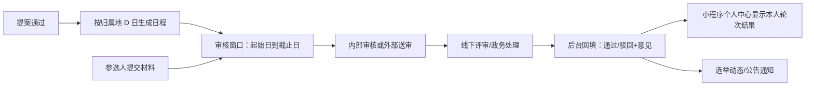
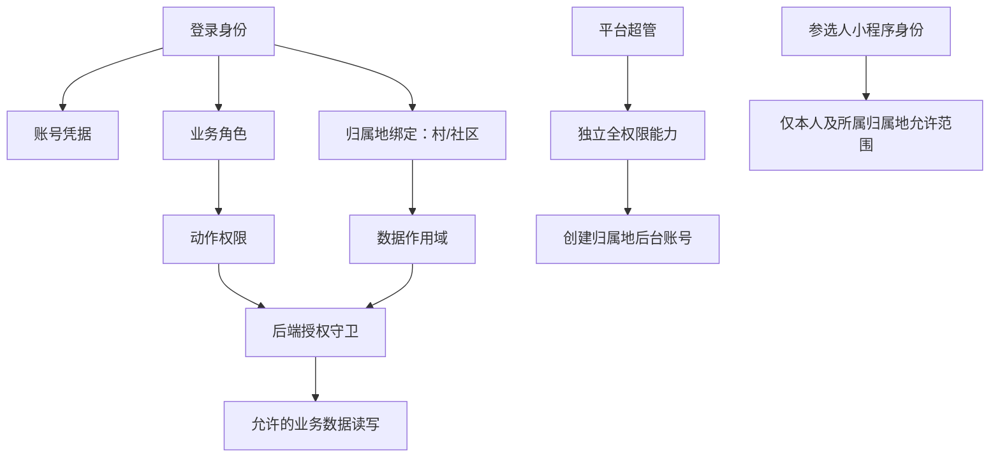

# 高危概念污染案：参选人被混同为选民

## 定性

这是当前发现的最高优先级概念污染。历史实现或文档把“参选人”和“选民/投票人”混用，疑似引入 `voter` 字段或角色，可能导致数据模型、接口、权限和前端功能整体偏航。

## 甲方裁决

| 概念 | 本项目含义 | 是否属于核心对象 |
|---|---|---|
| 参选人 | 报名参加村/社区换届、提交材料并接受各轮审核的人 | 是 |
| 选民 | 线下选举活动中的投票参与者 | 不是本系统管理对象 |
| 投票人 | 选民的同义业务称谓 | 不是本系统管理对象 |
| 审核人员 | 内部工作人员，按阶段处理候选人材料或回填线下结果 | 是 |
| 平台超管 | 平台全权限账号，创建归属地后台账号 | 是 |

## 明确不做

- 不做市民端投票。
- 不做选民注册和选民账号体系。
- 不做线上投票、计票、票箱、选票或投票人管理。
- 不把参选人建模为 voter。
- 不以“有投票流程”推导出“系统需要选民模块”。

## 实际闭环

## 必查污染点

1. 数据库表、字段、枚举、注释中所有 `voter`、`voters`、`elector`、`electorate`。
2. 前后端所有“选民”“投票人”“投票账号”的路由、接口和权限判断。
3. 小程序登录、注册、个人中心是否错误地按 voter 设计。
4. 候选人表是否存在重复身份字段，或把候选人状态写入 voter 语义字段。
5. 线下投票活动记录是否被误做成线上投票结果系统。
6. 审核按钮是否按 D 日阶段窗口控制，还是被错误替换为投票动作。
7. 通过/驳回结果是否能带驳回意见、日期并回显到参选人个人中心。

## 调查结论状态

- 甲方概念边界：已证实。
- 代码中是否存在污染：待取证。
- 污染影响范围：待取证。
- 是否需要删除或迁移字段：待完成代码、数据库和历史数据核验后决定。

## 一级病灶：身份、权限、登录和隔离混淆

甲方补充指出，历史实现对后台权限、角色、平台账号、登录账号和组织隔离的定义极其混乱。这意味着问题可能不在某个页面按钮，而在底层身份模型和授权边界。

### 病灶定性

- **账号**：是谁登录，凭什么凭据登录。
- **归属地**：账号属于哪个村或社区，能看哪些租户数据。
- **角色**：账号在该归属地承担什么工作职责。
- **权限**：该角色允许执行哪些动作。
- **登录入口**：平台超管、后台内部人员、参选人小程序是否分流。
- **数据隔离**：请求最终能否跨归属地读写数据。

以上六件事必须分开建模，再通过明确关系连接。历史代码若将其中多项塞进一个字段、一个枚举或一个模糊角色判断，均视为高危线索。

### 在重新取证前不得做的假设

- 不能把数据库里已有的角色名当成甲方认可的权限矩阵。
- 不能把“管理员”自动解释为平台超管。
- 不能把手机号、归属地或用户表中的某字段自动解释为完整身份。
- 不能因前端隐藏菜单就认为后端已完成授权。
- 不能因接口带有 `orgId` 就认为实现了可靠隔离。
- 不能从现有 `voter`、`user`、`admin` 等命名反推真实业务对象。

### 重建目标模型

### 取证优先级

1. 登录接口和 token/session 载荷：确认身份、归属地、角色究竟如何产生。
2. 后端每个路由的授权中间件：确认是否服务器端强制。
3. 数据查询的组织过滤：确认是否所有读写路径都带作用域。
4. 平台超管账号创建路径：确认是否真实独立、是否可被普通账号调用。
5. 角色到动作矩阵：从甲方事实和实际页面行为重新建立，不继承旧文档。
6. 小程序参选人身份：确认是否错误接入后台账号或 voter 模型。

