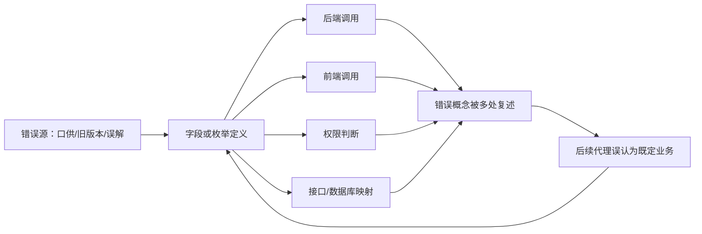

# 一级病灶：后台身份、角色、权限、登录与归属地隔离

## 结论等级

- 来源：甲方直接指出
- 等级：A，系统底层病灶
- 状态：已确认问题严重性，具体污染范围待代码取证
- 处理决定：不在现有权限实现上继续叠加业务功能

## 为什么这是底子坏了

后台系统的所有业务动作都依赖“谁在什么归属地，以什么角色，执行什么动作”。如果账号、归属地、角色、权限和登录分流混淆，表面功能即使能点击，也无法证明：

- 操作人是否有资格执行。
- 数据是否属于该村或社区。
- 平台超管能力是否被普通账号暴露。
- 参选人的小程序身份是否越界进入后台模型。
- 审核结果是否由正确的审核人员回填。

## 六层身份授权模型

| 层 | 要回答的问题 | 目标定义 |
|---|---|---|
| 身份 | 这个人是谁 | 可验证的登录主体 |
| 账号 | 凭什么登录 | 归属地、账号标识、密码等凭据 |
| 归属地 | 属于哪里 | 一个村或社区的业务数据作用域 |
| 角色 | 做什么工作 | 子管理、经办编辑、审核人、平台超管等 |
| 权限 | 能做什么 | 具体到动作和资源，不用模糊管理员 |
| 入口 | 从哪里进入 | 后台内部入口与参选人小程序入口分流 |

## 案件排查表

| 证据位置 | 排查内容 | 风险 | 状态 |
|---|---|---|---|
| 登录 API | 账号、密码、归属地如何校验 | 串租户、伪造身份 | 待查 |
| token/session | 是否包含并可信绑定角色和归属地 | 前端自报身份 | 待查 |
| 授权中间件 | 是否每个敏感路由服务器端校验 | 越权调用 | 待查 |
| SQL 查询 | 是否始终按归属地过滤 | 数据泄露 | 待查 |
| 超管入口 | 是否独立且只对平台超管开放 | 权限扩大 | 待查 |
| 后台账号创建 | 是否禁止公开注册 | 非授权账号 | 待查 |
| 小程序身份 | 是否仅绑定参选人 | voter 污染、越权 | 待查 |
| 审核动作 | 是否绑定审核角色和日期窗口 | 错误回填 | 待查 |

## 修复前的停工线

在上述证据没有闭环前，不接受以下工作为“修复”：新增页面、补一个角色判断、隐藏菜单、复制另一版本登录代码、把所有人设为管理员、继续使用含义不明的 voter 字段。

## 多源会诊污染：字段与概念的传播链

甲方补充指出，项目经历多个代理会诊后，存在字段调用、窜用和概念混淆。这类问题具有传播性：一个代理定义错误字段，另一个代理看到字段后把它当事实，第三个代理再围绕错误字段补接口和页面，最终形成“代码里存在所以业务需要”的假象。

### 污染传播模型

### 取证要求

对每个可疑字段建立完整调用卡，不只搜索字段名是否存在：

| 顺序 | 需要记录 | 关键问题 |
|---|---|---|
| 1 | 首次定义位置 | 谁、何时、在哪个版本引入？有甲方依据吗？ |
| 2 | 数据库真实含义 | 字段类型、约束、迁移、历史数据实际存什么？ |
| 3 | 后端读写点 | 哪些接口读取、写入、转换或默认填充？ |
| 4 | 前端调用点 | 哪些页面展示、提交、过滤或重新命名？ |
| 5 | 权限关联 | 字段是否被用来决定角色、归属地或可操作范围？ |
| 6 | 跨端映射 | 后台、小程序、邮件、公告是否各自用了不同语义？ |
| 7 | 业务证据 | 是否能回指甲方 DOCX 或直接证言？ |
| 8 | 裁决状态 | 保留、改名、迁移、废弃，或暂缓判断？ |

### 高危窜用模式

- 同一个 `user` 字段在不同模块代表内部工作人员、参选人或平台超管。
- 同一个 `orgId` 在登录、查询、写入和前端筛选中来源不一致。
- `role` 既表示岗位职责，又表示系统管理员等级。
- `voter` 被用来承载参选人、投票人或小程序用户三种不同对象。
- 状态字段在候选人审核、线下投票结果和公告发布之间复用。
- 前端请求参数被当作后端可信的身份或归属地。

### 证据纪律

字段名不是证据，调用次数不是合法性证明，历史数据不是甲方定义。每一处调用都必须回到对象、动作、归属地和权限四个问题。
