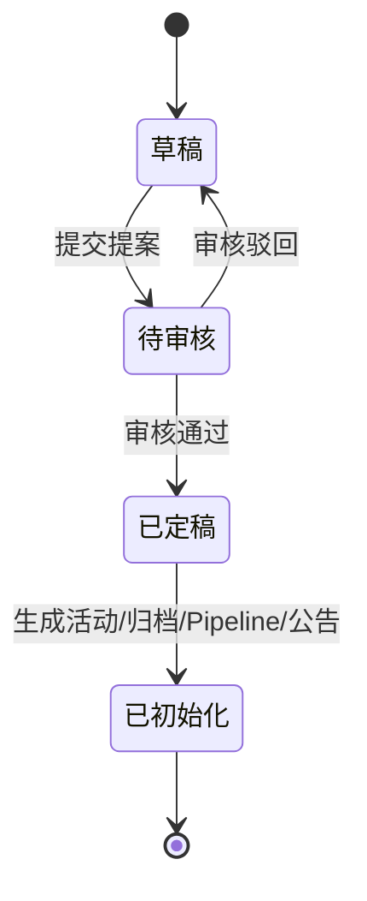

# 核心主链：提案到换届 Pipeline

## 证据属性

- 来源：甲方直接说明 A-006
- 等级：A，核心业务事实
- 状态：主链已确认，字段和具体阶段待 DOCX/代码核验

## 状态机

## 提案字段分组

| 分组 | 内容 | 后续用途 |
|---|---|---|
| 归属地与日期 | 村/社区、归属地、D day | 确定数据作用域和日期计算锚点 |
| 岗位配置 | 本届换届岗位、岗位要求、人数 | 生成岗位和参选人报名约束 |
| 报名材料 | 参选人需要提供的资料 | 小程序提交、后台查看、送审和归档 |
| 活动方案 | 文本编辑、文档附件 | 活动记录、归档、公告依据 |

## 关键状态行为

| 状态 | 查看 | 编辑 | 审核 | 允许的转换 |
|---|---|---|---|---|
| 草稿 | 是 | 有权限角色可编辑 | 否 | 提交为待审核 |
| 待审核 | 是 | 禁止 | 审核角色处理 | 驳回回草稿，或通过为定稿 |
| 已定稿 | 是 | 不得按普通提案修改 | 不重复审核 | 触发初始化 |
| 已初始化 | 是 | 由后续模块按权限办理 | 按阶段执行 | 随流程推进 |

## 初始化产物

1. 材料归档记录：提案附件进入归档侧边栏。
2. 当届活动记录：在历届列表中留下正式条目。
3. 当届日期 Pipeline：由归属地类型和 D day 计算。
4. 未发布公告集合：由当届流程和公告模板生成。

## 关键验证用例

- 提案审核中修改请求必须失败，且不改变原内容。
- 提案驳回后可编辑并能重新提交。
- 提案通过后应产生且只产生一套对应归属地、对应届次的初始化产物。
- 同一套 SOP 在不同村/社区使用不同 D day 时，日期应独立平移。
- 村和社区的岗位、阶段映射差异不能被统一模板吞掉。
- 初始化失败时不能留下“有活动无 Pipeline”或“有 Pipeline 无公告”的半成品，事务边界待代码核验。

