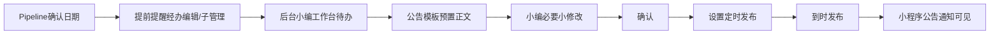
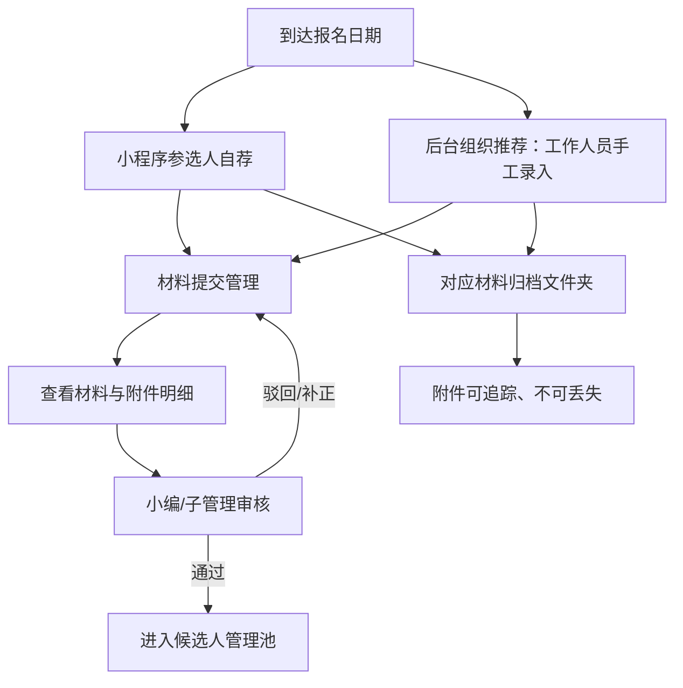

# 公告与报名材料业务链

## 证据属性

- 来源：甲方直接说明 A-007
- 等级：A，核心业务事实
- 状态：业务链已确认，权限细节和代码映射待核验

## 公告链

## 报名材料链

## 业务约束

| 环节 | 必须成立 |
|---|---|
| 公告提醒 | 以 Pipeline 日期为触发依据，不靠人工记忆 |
| 公告正文 | 来自预设模板，小编只做必要修改和确认 |
| 发布 | 确认后定时发布，发布状态可追踪 |
| 小程序 | 参选人可看公告通知，不获得后台管理能力 |
| 报名 | 只有到达对应报名日期才进入业务窗口，具体窗口以 Pipeline 为准 |
| 材料审核 | 后台可查看提交人和附件明细，通过后才进入候选人池 |
| 来源 | 区分参选人自荐与组织推荐，不能混成选民来源 |
| 文件 | 所有上传文件进入对应材料归档目录，并保持关联 |

## 待核验

- 经办编辑、子管理、审核人对材料查看、审核、退回、补正的具体权限。
- 公告提前提醒的提前量和通知渠道。
- 小编“小修改”的允许范围及发布前后锁定规则。
- 定时发布失败、重复发布、跨归属地发布的处理。
- 组织推荐的数据来源、录入字段、附件要求和是否需要单独标识。
- 材料归档目录命名、归属地/届次/候选人关联和重复上传规则。

