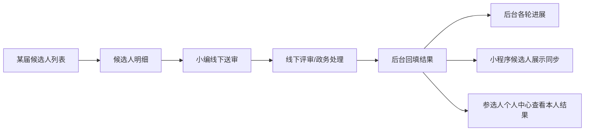

# 候选人管理与多附件案

## 证据属性

- 来源：甲方直接说明 A-008
- 等级：A，核心业务事实
- 状态：业务链已确认；当前单附件预览为已确认缺陷

## 候选人管理业务流

1. 候选人进入候选人管理后，先按届次进入每一届的列表。
2. 点击某一届，进入该届候选人明细。
3. 候选人审核由小编按照 Pipeline 阶段在线下送审、线下处理。
4. 工作人员将线下审核结果回填到后台系统。
5. 后台展示候选人各轮审核进展。
6. 小程序在候选人展示处同步展示对应候选人的进展。
7. 小程序个人中心展示参选人自己的审核结果，不承载线上投票。

## 线下送审与线上回填边界

## 多附件是硬约束

- 一个候选人的报名材料一定是多份，不是单个文件。
- 材料应以附件集合建模，至少保留每份附件的独立元数据和候选人/届次/归属地关联。
- 后台候选人详情必须能够列出、预览、下载和追踪全部附件，不能只取第一份。
- 当前后台只能预览一份附件，登记为“天坑”级已确认功能缺陷。
- 单附件预览不能被解释成甲方只要求一份材料，也不能通过覆盖旧文件来伪装多附件支持。
- 所有附件仍必须进入对应材料归档目录，并能从候选人、届次和归属地回溯。

## 资料操作与体验标准

- 后台必须支持一键下载某候选人的整套资料，不能要求工作人员逐个附件点击下载。
- 整套资料下载必须包含该候选人本届全部附件，并保持文件名、材料类型和归属关系清楚。
- 附件预览必须舒服、清晰、可连续操作，工作人员能快速切换查看多份材料，不被单文件弹窗、截断、错位或难以辨认的展示阻塞。
- 预览、下载、外部送审和归档是四个相关但不同的动作，不能用“只能预览一份”代替其他能力。

## 材料归档标准

- 材料归档必须结构清晰，工作人员能按归属地、届次、候选人、材料类型定位文件。
- 不允许文件散落在无关联的目录、临时目录或混杂在其他候选人资料中。
- 每份附件都必须可追溯到来源：小程序自荐或后台组织推荐，以及上传人、上传时间和所属业务对象。
- 归档结构应支持从候选人详情反查归档位置，也支持从归档目录反查候选人和届次。
- 同一候选人的多份资料不能相互覆盖，重传和修订必须保留清楚的当前版本或历史关系，具体保留策略待甲方 DOCX 核验。

## 甲方收口判断

项目整体是一个围绕归属地和 D 日 Pipeline 运转的内部换届工作系统：提案定稿驱动活动、日程和公告；公告按模板提醒、确认、定时发布；参选人通过小程序自荐或由组织推荐进入材料审核；候选人按届管理，线下送审后后台回填结果，小程序同步展示；所有材料必须清楚归档并支持整套资料下载与舒适预览。

## 建议的验收事实，不是现阶段代码方案

- 提交三份不同类型材料后，后台详情应显示三份，而非一份。
- 每份材料都能识别材料类型、原始文件名、上传时间、来源和归属关系。
- 预览其中任意一份不会替换或丢失其他附件。
- 线下送审时可以下载或整理全部候选人材料。
- 审核回填结果后，小程序只同步结果和进展，不暴露不应公开的内部附件或内部评审信息。

## 待核验

- 每一届候选人列表的唯一届次键和归属地键。
- 候选人各轮审核与 Pipeline 阶段的关联方式。
- 小编、子管理、审核人对候选人详情和附件的动作权限。
- 外部送审附件包的组成、下载格式和邮件发送记录。
- 小程序展示哪些进展字段，哪些内部字段必须隐藏。
